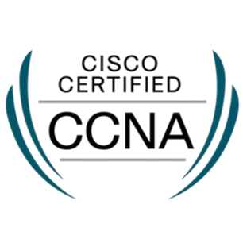
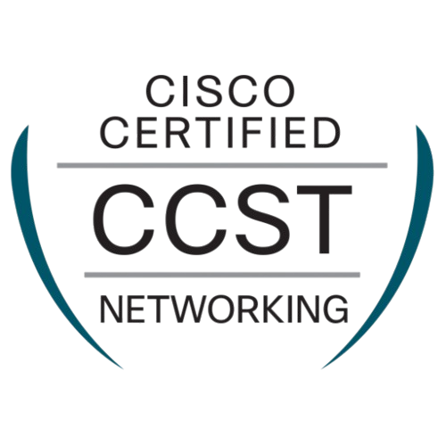
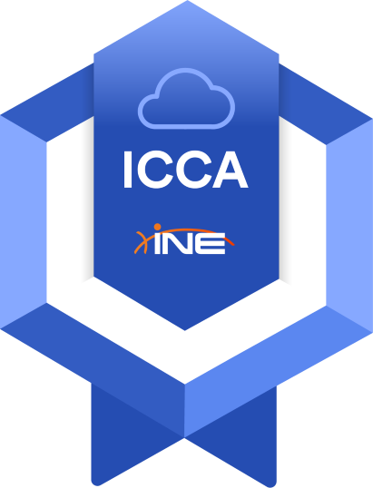

<h1 align="center">
   Hey there, I'm Rani Kamaleddine!
</h1>

  

  

---
 
## 🔍 Who Am I?

Aspiring Cybersecurity Specialist with CCNA certification and hands-on experience in networking, system troubleshooting, and security tools like Splunk, Wireshark, and Burp Suite. Skilled in building and repairing PCs, simulating enterprise networks, and creating cybersecurity labs and projects. Passionate about continuous learning and advancing in the cybersecurity field.

  

## 🧰 My Cyber Arsenal

| 🔧 Category | 💻 Tools & Platforms |
|------------|----------------------|
| **Operating Systems & CLI** | Kali Linux, Parrot OS, Ubuntu, Linux Mint, Windows, Bash |
| **Networking & Protocols** | Cisco IOS (VLANs, STP, OSPF, EIGRP), Packet Tracer, NAT, ACLs |
| **Recon & Scanning** | Nmap, Wireshark, Netdiscover, tcpdump, Gobuster |
| **Web Application Security** | Burp Suite, OWASP DVWA, Safeline WAF, Nikto |
| **Exploitation & Cracking** | Metasploit, SQLMap, Hydra, JohnTheRipper, XSS & SQLi scripts |
| **Defensive & Monitoring** | Phishing Simulations, WAF Behavior Analysis, Splunk, Wazuh |
| **Lab & Development Tools** | VirtualBox, Cisco Packet Tracer, VS Code, GitHub, Git |

---

## 🛠️ Featured Projects

### 🎯 Phishing Awareness Simulator  
Developed a phishing simulation page to demonstrate social engineering tactics in a safe, educational setup.

-  Deployed a realistic login interface (HTML/CSS) to simulate credential harvesting  
-  Captured user metadata (IP, browser, screen resolution) for training purposes  
-  Sent real-time alerts via Telegram Bot API  
-  Deployed on GitHub Pages for public accessibility  

👉 [Live Demo](https://0xpynge.github.io/phishing-awareness-simulator/phishing-simulator/r4n1.html)  

⚠️ *Educational purposes only. No real services or data targeted.*

---

🧩 Multi-Site Enterprise Network Lab - CCNA Level
A full-fledged Cisco Packet Tracer simulation featuring:
- Enterprise Design & Segmentation - Built a multi-site enterprise network in Cisco Packet Tracer with VLANs for data, servers, VoIP, and management, centralized via VTP; configured dedicated Voice VLANs for IP phones and inter-VLAN routing on multilayer core switches.
- High Availability & Redundancy - Implemented HSRP virtual gateways, Rapid-PVST for fast STP convergence, BPDU Guard for edge port protection, and LACP EtherChannel between cores for load balancing and fault tolerance.
- Services & Security - Deployed DHCP with helper addresses for all VLANs, secured access ports with Port Security (max 2 MACs per port), and configured static plus floating static routes for branch connectivity failover.
- WAN & External Connectivity - Established point-to-point /30 links (10.10.10.0/30 & 11.11.11.0/30) from cores to the edge router, providing WAN access to branches and default routing to the ISP for internet reachability.

🔗 [View on GitHub](https://github.com/0xpynge/ccna-enterprise-lab)

---

## 📜 Certifications Snapshot  

  
  
  

  
  

---

## 🧠 TryHackMe Stats

  

  

<i>Note: Badge image may not auto-update. Click above for live stats.</i>

---

## 🌐 Connect With Me

  

## 📢 Join Our WhatsApp Channel

Stay updated with our latest news and updates via WhatsApp!

  

---
 

      
  

  

     <!-- Snake -->
  

